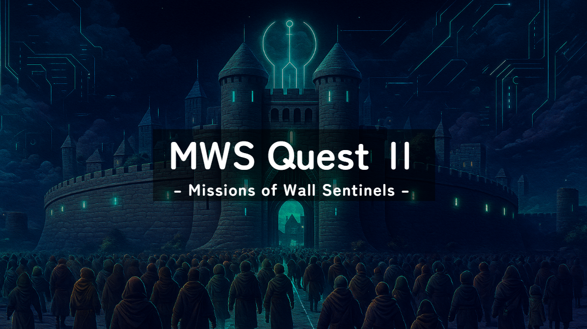
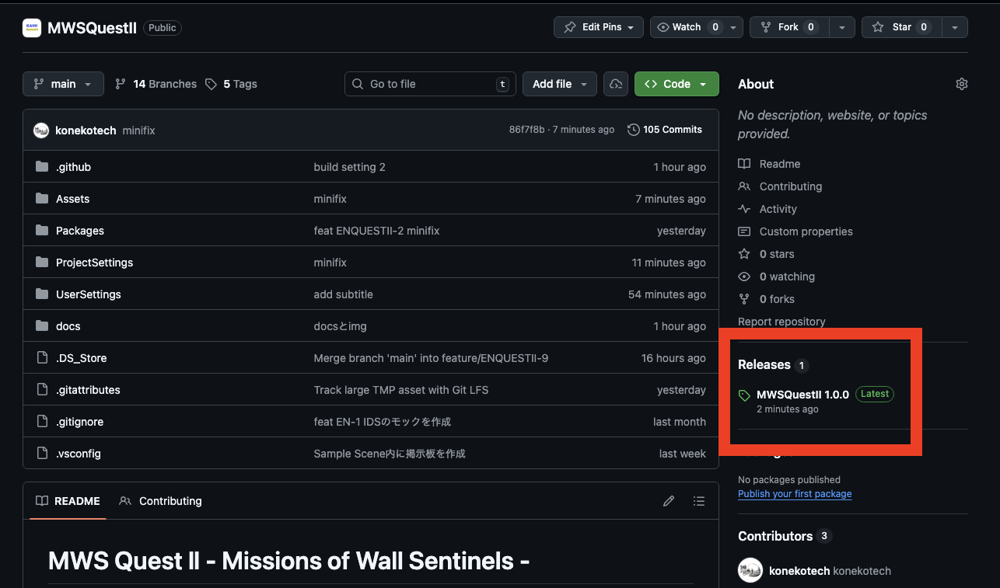
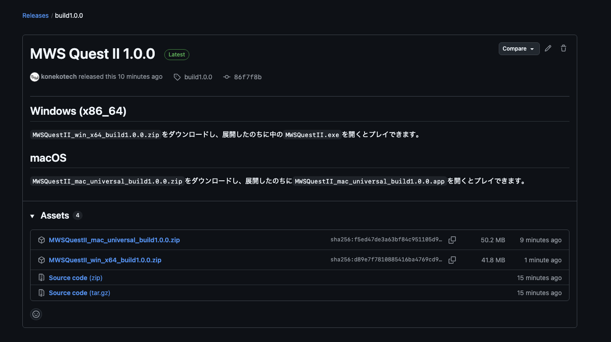

# MWS Quest Ⅱ - Missions of Wall Sentinels -

## Table of Contents

_**for general**_

- [About](#about)
- [IPS編のシナリオ](#IPS編のシナリオ)
- [MWS Quest Ⅱ の今後](#mws-quest-Ⅱ-の今後)
- [MWS Quest の使用方法](#mws-quest-Ⅱ-の使用方法)

_**for developers**_

- [リポジトリ構成](#リポジトリ構成)
- [構成技術](#構成技術)
- [Contribution](#contribution)
- [License](#license)

_**for MWSCup**_

- [審査基準について](#審査基準について)

## About

MWS Quest Ⅱ - Missions of Wall Sentinels - (以後、MWS Quest Ⅱ)は、Firewall・IPSを使ったサイバー空間での攻防戦を体験できるゲームです。FirewallやIPS（侵入防止システム）を駆使した戦いを、国の城壁を守るかのような攻防戦に落とし込みました。
初学者でも手軽に遊ぶことができ、実際のコマンド操作を体験できます。また、実際の攻撃を基に問題を作成したため、セキュリティに関する知識も身につけることができます。
このゲームはFirewall編（基礎編）とIPS編（応用編）の２種類のシナリオをプレイすることができます。（現状では、IPS編のみ遊ぶことができます。）

> このツールは`MWSCup 2025 ハッカソン課題`として`EN頼み`が作成しました。

### セキュリティ教育の重要性と既存サービスの問題

近年、サイバー犯罪による被害額が増加し、サイバーセキュリティ対策の重要性が高まっています。
独立行政法人情報処理推進機構（IPA）が毎年出版している[「情報セキュリティ白書2025」](https://www.ipa.go.jp/publish/wp-security/j5u9nn0000004wk0-att/ISWP2025_ALL.pdf)によると、2024年のサイバー犯罪の被害額は166億ドルに上っています。

また、高校教育の「情報Ⅰ」の必修化、AIブーム、政府のDX推進を踏まえると、情報教育の必要性が高まっていると言えます。

このような背景を踏まえると、初学者が手軽にサイバーセキュリティを学べるツールが必要であると言えます。
現状では、「セキュリティ」の防御を学習できる既存のサービスには以下のようなものが存在しています。

- CyberDefenders
- Hack The Box
- Blue Team Labs Online

しかし、これらに取り組むには事前知識が必要であり、初学者にとって難易度や敷居が高いという問題点があります。
そこでEN 頼みは、以下の 3 つを満たすツールとして MWS Quest Ⅱ を提案します。

- サイバー攻撃に対する知識が身につく
- セキュリティに興味を持ってもらう
- 初学者でも手軽に学びやすい

### MWS Quest Ⅱ のコンセプト

MWS Quest Ⅱ は以下の 3 つの強みがある体験型学習ツールです。

- 実際の攻撃と対応付けて学べる
  - 実際のサイバー攻撃を基に問題を作成
- 初学者でも楽しく学べる
  - サイバー空間での攻防戦を国の城壁での攻防戦に見立てる
  - コマンドの説明や使い方が分かるサポート機能を搭載
- 実際のコマンド操作を体験できる
  - Snortを基にフィルタルールを設定

## IPS編のシナリオ

EN 頼みはシナリオの一例として、実際のサイバー攻撃を基にIPS編の問題を作成しました。

### ゲーム概要

- 舞台
  - 国の城壁をFirewall・IPSに模した「X国」
- 設定
  - 日々他国から人々がやって来るが、中には悪いことを考えている人もいる
- モデル
  - 実際のサイバー攻撃を基に問題を作成
    - DoS攻撃
    - IPスプーフィング攻撃
    - ポートスキャン
    - マルウェア送付
- 操作
  - ログや住民の意見を参考にし、正常な人を許可、異常な人を拒否・逮捕するフィルタルールを追加する

### 現実との対応付け

| 現実の用語               | ゲーム内の用語                  |
| ------------------------ | ------------------------------- |
| 送信元IPアドレス             | 出発地                              |
| 宛先IPアドレス             | 目的地 |
| 宛先ポート番号                 | 職業                      |
| パケットサイズ               | 荷物量                        |
| ペイロード                 | 荷物                            |
| pass                   | 入国を許可                |
| drop                   | 逮捕                  |
| reject              | 入国を拒否                            |
| トロイの木馬（マルウェア）               | 木馬                            |
| 城壁           | Firewall・IPS              |

### シナリオの目標

- 住民の意見を基に異常な人のX国への入国を阻止する
  - クリア条件
    - 合計スコアが 288 点以上（満点300点）
  - クリア方法
    - 住民の意見やログを参考にフィルタルールを設定し、正常な人を許可、異常な人を拒否・逮捕する

### ゲームの流れ

- 詳細は[ゲームフロー](game_flow.md)を参照

## MWS Quest Ⅱ の今後

- コンテンツ拡充のためのシナリオ追加
  - シナリオ例：時代に合わせた新たな攻撃（APT攻撃）
- Firewall編の実装
  - FirewallとIPSの役割を理解できる

## MWS Quest Ⅱ の使用方法

### ダウンロード・実行方法

1. GitHubの右側にある [Releases]() にアクセスします。

2. プレイ環境に合わせて、ZIPファイルをダウンロードします。
   - Windows: `MWSQuestII_win_x64_build1.0.0.zip`
   - Mac: `MWSQuestII_mac_universal_build1.0.0.zip`

3. 必要に応じてダウンロードしたZIPファイルを任意の場所に展開します。
4. 展開したフォルダ内にある実行ファイルをクリックして起動します。インストールは不要です。警告が出る場合は必要に応じてセキュリティの設定を変更してください。
   - Windows: `MWSQuestII.exe`
   - Mac: `MWSQuestII_mac_universal_build1.0.0.app`

### プレイ方法

1. ゲームを起動する
2. タイトル画面が表示されたら、スタートボタンをクリックしてHome画面に移動する
3. フィルタルール設定して、設定画面を閉じると運用開始
4. シナリオをクリアしたら、解説画面に進み、タイトル画面に戻る

### フィルタルール

- 詳細は[フィルタルール](rule_flow.md)を参照

## リポジトリ構成

## 構成技術

ゲームエンジン: Unity

## Contribution

このプロジェクトはどんな Contribution も歓迎します。
開発方法、Contribution に関する詳細は[CONTRIBUTING](./CONTRIBUTING.md)を参照ください。

## License

このソフトウェアは、**MIT LICENSE** で提供されています。ただし、[クレジット](#クレジット)に記載されている素材については、それぞれのライセンスに従います。

## 審査基準について

### 要件

- 作品をインターネットで公開し、多くの人が利用、改良できる
- 作品による法令違反、権利侵害、倫理的問題はない

### 新規性

- セキュリティ機器の動作の学習

### 実用性

- 初学者でも手軽に遊べる
- 実際のフィルタルールを模したコマンド操作を体験することができる
- 実際のサイバー攻撃と対応付けて学ぶことができる

### 継続性

- 新しいシナリオの追加による拡張性
