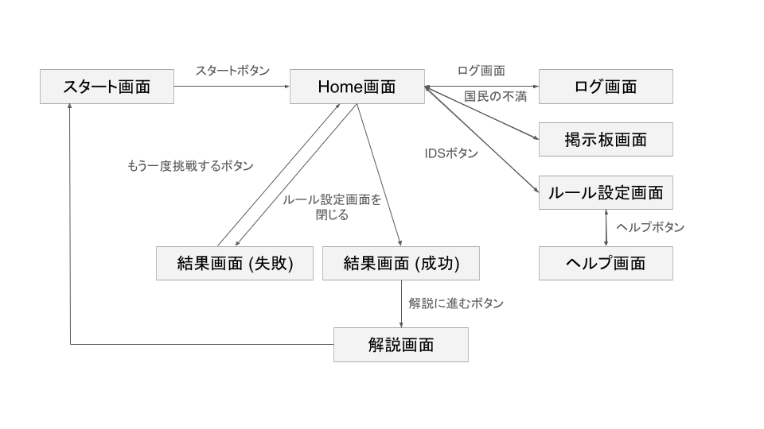
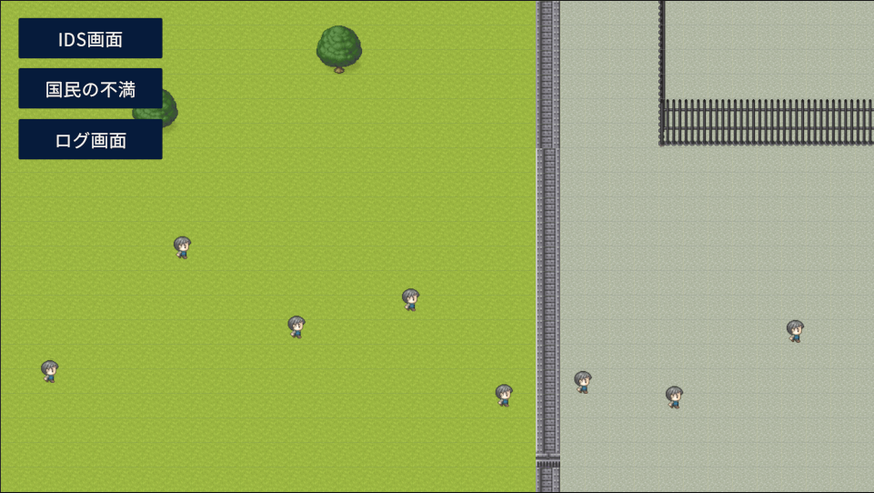
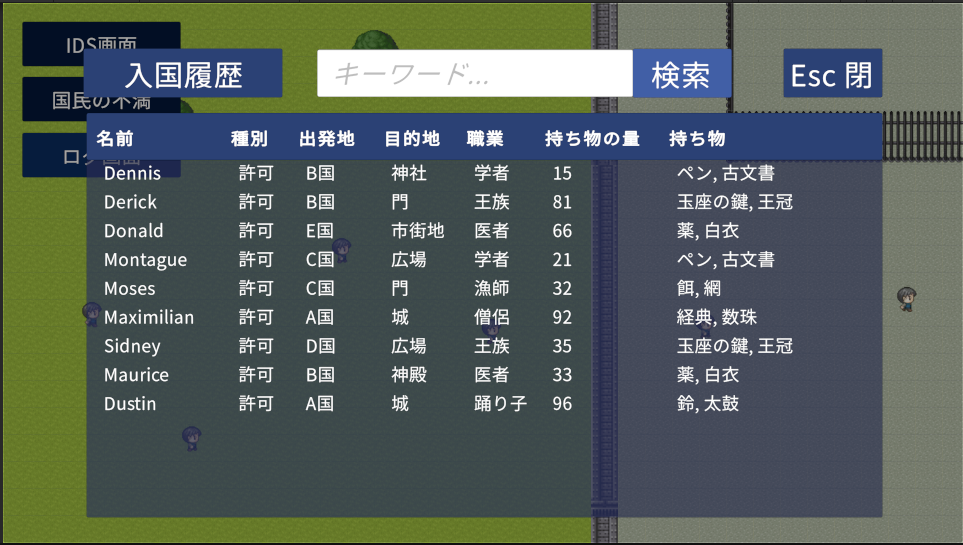
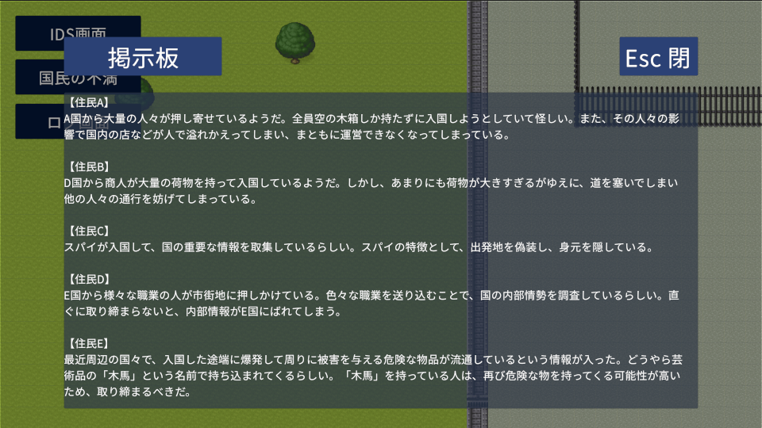
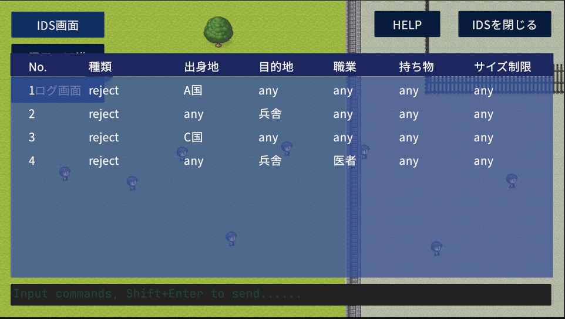
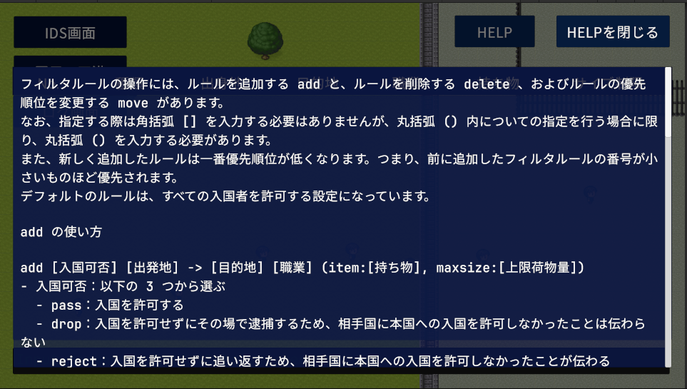
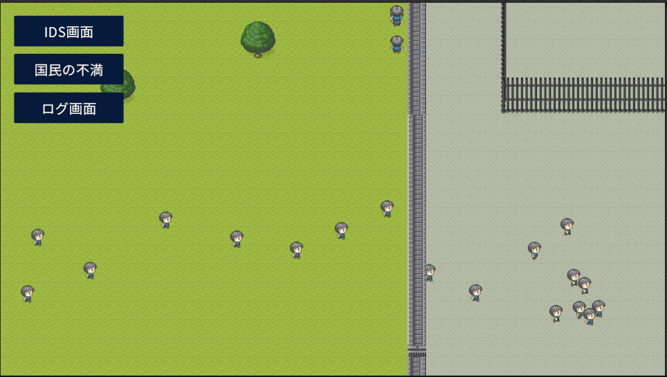
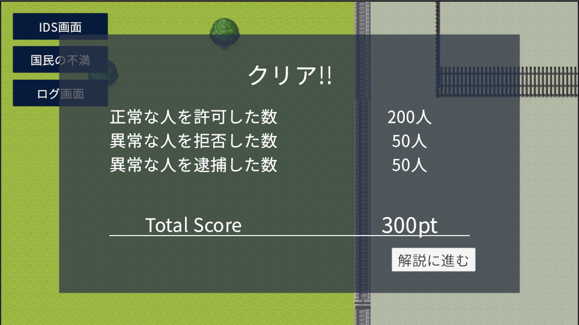
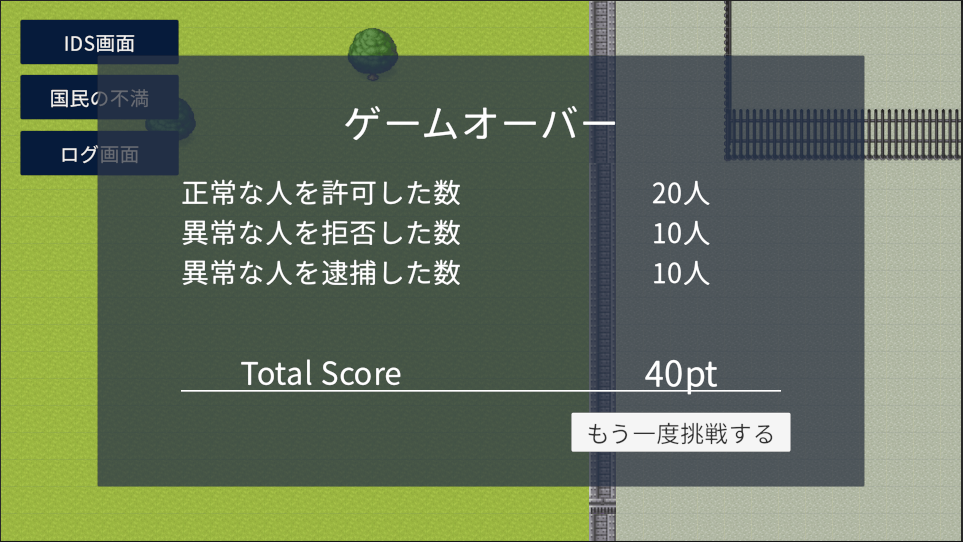
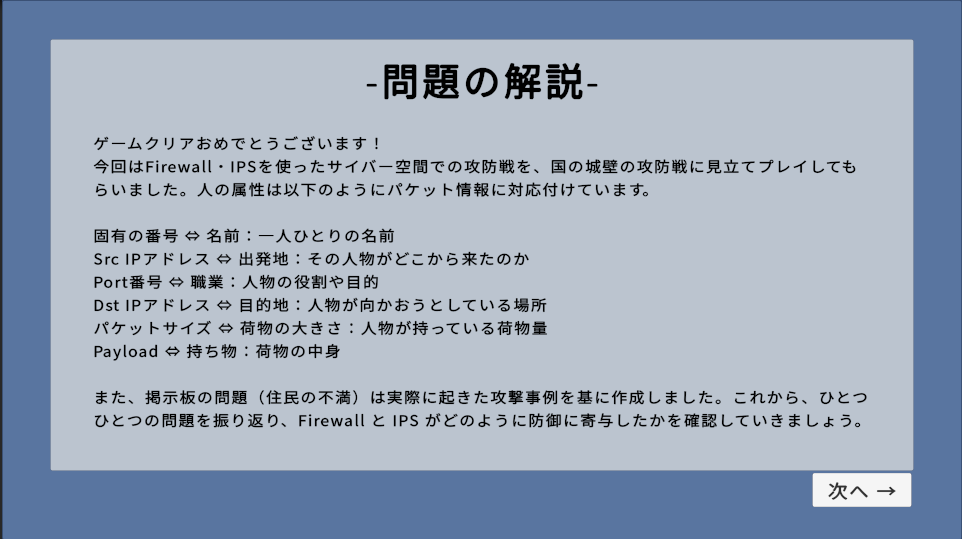

# ゲームフロー
1. タイトル
2. Home画面
3. ログの調査
4. 掲示板での情報収集
5. ルールの設定
6. ヘルプ画面
7. 実際にルールを運用
8. 結果
9. 現実の攻撃との対応づけの解説

## 画面遷移図

## 各場面の詳細

### タイトル
- `Start`ボタンをクリックするとHome画面に遷移

画面イメージ

### Home画面
- `スタート`，`ルール`，`ログ`，`掲示板`ボタンを配置
  - `スタート`ボタン→ルールの運用開始
  - `ルール`ボタン→ルールの設定に進む
  - `ログ`ボタン→ログの調査に進む
  - `掲示板`ボタン→掲示板に進む
- 画面には国外と国内の様子が表示される
- ゲームが開始されると人が移動する様子が表示される

画面イメージ

### ログの調査
- ログ調査画面で入国の記録を確認する
- 検索によって検索キーワードを含むログの絞り込みが可能

画面イメージ

### 掲示板での情報収集
- 住民からの意見を収集
- シナリオに関連する意見が表示される

画面イメージ

### ルールの設定
- ログや掲示板の情報を基にルールを設定
- ルールの記述にはSnortを模したコマンドを利用
- ルールの詳細については[フィルタールール](rule_scenario.md)を参照

画面イメージ

### ヘルプ画面
- コマンドの使い方について記述
- 初学者でもコマンドを見ながら記述できる

画面イメージ

### 実際にルールを運用
- 設定したルールを基に入国管理を行う
- Home画面で`スタート`ボタンをクリックすると運用が開始される

画面イメージ

### 結果
- ゲームクリアorゲームオーバーを表示
- ゲームスコアの内訳と合計得点を表示
- ゲームクリアなら`解説に進む!!`ボタン，ゲームオーバーなら`もう一度挑戦する!!`ボタンが表示

画面イメージ

### 現実の攻撃との対応づけの解説
- 今回扱ったシナリオと現実の攻撃の対応づけを解説
- `次に進む`ボタンで次の攻撃の解説に進む
- `戻る`ボタンで前の解説に戻ることが可能

画面イメージ

